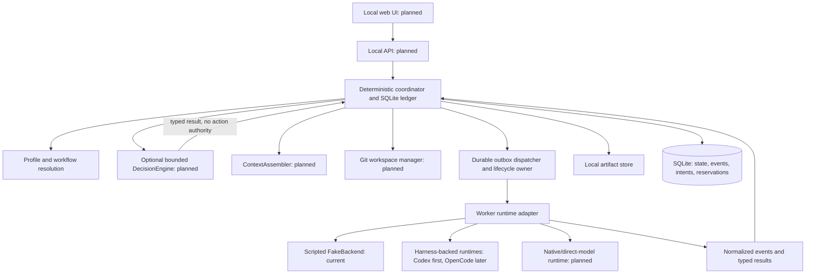

# Implementation plan

Status: architecture and acceptance criteria, updated 29 September 2026. Milestones 1–3 are implemented and validated. Milestone 4's controls and recovery implementation is present and focused offline fake-backend tests pass, but full acceptance remains unverified, including browser/client-closure behavior (there is no UI/API integration to exercise). Milestones 5–10 are planned.

## 1. Runtime decision

Keep **a small deterministic Python coordinator** with SQLite as the sole authority for workflow progression, admission, retries, handoffs, runtime controls and persisted state. The coordinator follows validated topology and policy. When fixed rules cannot express a decision reliably, an optional `DecisionEngine` may choose from a bounded set of allowed outcomes; deterministic code validates that result and performs every action.

This is a personal, local-first open-source tool, not a hosted workflow service. Optimize for developer usefulness, control, inspectability, reproducibility, flexibility and engineering quality.

| Requirement | Deep Agents | LangGraph | Custom coordinator |
|---|---|---|---|
| Explicit topology, named specialists | Agent delegation needs additional constraints | Direct graph/node fit | Validated preset stages |
| Parallelism | Delegation still needs application admission limits | Parallel nodes; external-worker admission still needed | One transactional global/project/run admission check |
| Checkpoints, persistence, inspection | Inherits graph facilities | Strong built-in state/history | SQL state, immutable specifications and event journal |
| Pause/resume, conditional routes, retries | Harness behavior must be constrained | Native graph concepts | Small, explicit transition rules |
| Steer/stop external workers | Requires adapter and supervisor | Requires adapter and supervisor | Runtime adapter and lifecycle owner |
| Semantic choices inside a fixed workflow | Model delegation can reshape execution | Can be encoded in nodes, with policy still required | Optional bounded DecisionEngine result; coordinator owns execution |
| Lock-in / total moving parts here | Adds another agent harness | Adds a second progression journal unless carefully integrated | Own a bounded scheduler; keep inference behind a typed seam |

LangGraph is a credible alternative. However, this product needs events, command receipts, worker attempts, resource reservations and launch intent committed atomically. Its SQLite checkpointer does not remove that ledger. Awaiting workers inside graph nodes adds reconciliation between two journals; using graph ticks only to emit an outbox leaves almost all scheduling in our code. Keep the current bounded transition function as the authority. [Evidence and switch conditions](INTEGRATION_AUDIT.md).

Coordinator scope is limited to declared dependencies, bounded fan-out, joins, admission, policy validation and state transitions. A decision result may choose only among options the resolved run already permits. Keep arbitrary workflow generation, user code in workflow definitions and historical side-effect replay outside this contract. Reconsider a graph framework only if it can own progression without duplicating this ledger.

## 2. Architecture and module ownership



The product remains one local service with one coordinator owner, SQLite and filesystem artifacts. When the UI arrives, keep it on loopback and make it a client of the service; closing a browser must not stop execution. FastAPI/Jinja and Server-Sent Events remain a planned UI choice. Use short SQLite transactions and keep external worker execution outside them. Each runtime adapter owns its worker lifecycle and reports capabilities through the provider-neutral contract.

```text
src/orchestrator/
  cli.py/config.py/validation.py/resolution.py/schemas.py  current configuration and entry points
  domain/        current versioned models, IDs, states and policies
  execution/     current deterministic coordinator
  backends/      current protocol and fake; Codex/native adapters planned
  persistence/   current SQLite ledger, migrations and ownership
  artifacts/     current atomic file writes, manifests and content hashes
  context/       planned bounded context assembly and provenance
  workspaces/    planned Git snapshots, isolated worktrees and integration
  app/api/web/   planned local service composition, controls and UI
presets/         agents.toml and workflows/*.toml
config/          project/backend examples and development presets
tests/           current offline tests; workspace/API/live suites are planned
docs/            contracts, decisions and operating guide
```

Dependencies point inward to `domain`; the composition root wires implementations. Keep persistence behind one transaction API, not a generic repository per table. Start event models in `domain` and preset loaders there; add separate packages only when they have independent behavior.

## 3. Configuration and core models

Use **TOML + Pydantic v2**, `extra="forbid"`, explicit enums and `schema_version`. Generate JSON Schema from Python models. A frozen Pydantic object alone does not freeze nested dictionaries: serialize a canonical resolved specification, hash it, and never update that stored payload.

| Model | Required contents |
|---|---|
| `AgentProfile` | Stable role identity, objective, base prompt, skills/tools, permission ceiling, context expectations, timeout, retry policy and metadata; v1 also stores a default backend/model binding |
| `WorkflowPreset` | Versioned ID; allowed profiles; required and optional stages; fixed/select-one/elastic slot limits; dependencies and parallel groups; declared conditions; allowed handoff redirects; outputs; completion rules; retry and wall-time limits |
| `OrchestratorPolicy` | Allowed profile/backend/model bindings, worker-count bounds, skip/redirect/retry decisions, permission ceiling and immutable required verification |
| `ProjectConfig` | Project path, workflow/profile overlay references, model bindings, project concurrency, permitted commands and workspace policy; settings revision |
| `RunSpec` / `RunState` | Immutable task, project snapshot, overrides, compiled workflow, profiles and frozen policy; mutable state projection, revision, active stages and budget counters |
| `AgentRunSpec` / `AttemptState` | Immutable attempt ID, parent retry ID, resolved profile/version, assembled instructions and input manifest, concrete backend/model/effort, permissions, skills/tools and workspace revision; projected lifecycle, timestamps, receipts and evidence references. The target execution binding adds runtime/provider identity. |
| `Handoff` / `Artifact` | Source attempt, destination slot, input revision, content hash, project revision, schema and path; artifacts use managed relative paths |
| `Intervention` / `Event` | Command UUID, actor, target, expected run revision, kind, payload; event sequence, timestamp, cause, result and delivery status |

### Profile identity and execution binding

A specialist profile describes its stable role, skills, tools, policy and context expectations. The target `ExecutionBinding` selects a runtime, provider, concrete model and effort/reasoning configuration under project and workflow policy. A profile may name a default binding; run-level comparisons and overrides can select another approved binding without changing the specialist's identity.

V1 has not completed this separation: `AgentProfile.backend` is fixed, `model_binding` is a default alias, and the resolver only accepts model bindings on that same backend. Current resolved attempts do persist the concrete backend, model ID and effort. Keep existing snapshots readable and immutable; introduce the new binding model additively with a schema version and migration before cross-runtime profile selection is enabled.

Every worker returns an `artifact-envelope-v1`: attempt ID, input revision, workspace revision if applicable, status (`pass`, `fail`, `blocked`), summary and typed artifact entries with content hashes. A valid envelope does not imply that a stage passed. Before real write workflows, define and version payload schemas for at least:

| Payload | Required evidence |
|---|---|
| `Plan` | Bounded tasks, dependencies, ownership conflicts, proposed specialist/count within declared limits, and acceptance evidence; proposals never create workers by themselves. |
| `ChangeSet` | Base revision, patch or commit reference, changed-file manifest, output hashes and the checks run against that revision. |
| `ReviewReport` | Reviewed revision, verdict, severity-ranked findings, evidence references and unresolved risks. |
| `TestReport` | Tested revision, validation commands, exit results and evidence references; a process exit alone is not a passing report. |
| `ResearchReport` | Claims linked to source references, support/uncertainty, and unresolved claims. |
| `PrototypeReport` | Prototype revision and artifacts, validation result, explicit limitations and incomplete requirements. |
| `HandoffSummary` | Selected verified revision, links to persisted artifacts, remaining limitations and open questions. |

Each payload needs a versioned schema ID, byte/hash verification, stage-specific validation and a persisted provenance link to its attempt/input/revision. Store large bodies in the artifact store; keep validated metadata and hashes in SQLite. The current v1 result stores hashes and a summary but no body bytes or stage-specific schema registry, so these checks are future work, before real worker output is trusted.

Milestone 3 can currently validate envelope identity, required stage/profile output names, SHA-256 metadata, safe relative paths, and consumed input/workspace revisions. The v1 `WorkerResult` stores output hashes and a summary but no output bytes or stage-specific body schema registry, so report sections, prototype limitation labels, and research claim/source mappings cannot yet be checked. Define those payload contracts before wiring real worker output and workspaces.

Resolution order: shipped defaults → project overlay → user-selected run overrides, with **policy ceilings applied after merging**. Resolve model aliases against the selected backend's available models and supported effort values; persist the concrete IDs before dispatch. A missing binding or unsupported setting is a preflight error, not silent fallback. Skills default to empty and memory to `disabled`.

Milestone 1 overlay files are versioned, strict sparse patches. Agent overlays may change the base prompt, model binding, effort, timeout, context policy or permissions; permissions may only tighten the profile's declared set. Workflow overlays may choose a default profile from the stage's declared specialists or a worker count within its declared bounds. They cannot change stage IDs, dependencies, conditions, outputs, policy, or required verification. Run overrides use the same declared recipient/model/effort/count limits. Unless a workflow declares a narrower `permission_ceiling`, the selected profile's original permissions are the ceiling; v1 rejects permission expansion.

Resolved runs contain tuple-backed immutable snapshots, including `ResolvedOrchestratorPolicy`. Their SHA-256 is computed over canonical UTF-8 JSON for the complete resolved `RunSpec`, with sorted object keys, preserved list order, compact separators and the `snapshot_hash` field excluded. Older snapshots without the additive policy field deserialize with a fail-closed policy and cannot launch workers. Backend availability is supplied to the resolver as data; configuration validation does not query a provider. Shipped aliases such as `standard` can therefore validate while a run remains blocked until its project model binding and backend availability are present.

Overrides cannot replace workflow edges, remove required stages or expand permissions. An elastic slot resolves once to a count within min/max and that count is persisted in the resolved stage selection. No validated planner-partition model exists in v1, so the deterministic fallback is the minimum count; a future planner may only choose a count/partition after a versioned contract validates it. Research uses the first N declared `slot_briefs` plus the task; their explicit overlap is allowed because they do not write deliverable code. Select-one chooses one allowed profile using an explicit override or a declared default. Profiles default to the `standard` model binding; policy also permits `deep` and `fast` when the user configures them, allowing role-specific model routing. V1 fixtures declare Codex and fake backend settings, but only the scripted fake adapter is implemented; Codex is planned for milestone 6.

`ContextAssembler.build(profile, run_snapshot, task, input_manifest) -> ContextBundle` is planned for milestone 7. Version 1 will assemble only explicit task inputs, scoped responsibility, selected source references, dependency outputs and known constraints. Enforce a byte budget with deterministic truncation notices; required inputs cannot disappear silently. Persist supplied text/reference hashes and reasons for inclusion. Do not copy a whole orchestration transcript. Keep app-assembled context distinct from the selected runtime's own hidden prompt and inherited project instructions. Long-term memory is a later, opt-in extension; it is disabled in current profiles and project settings.

## 4. WorkerBackend contract

Keep SDK classes inside `backends/codex.py`. The following signatures are the proposed domain contract, not claims about SDK method names:

```python
class WorkerBackend(Protocol):
    async def capabilities(self) -> BackendCapabilities: ...
    async def preflight(self, spec: AgentRunSpec) -> PreflightResult: ...
    async def start(self, spec: AgentRunSpec) -> WorkerHandle: ...
    def events(self, handle: WorkerHandle) -> AsyncIterator[WorkerEvent]: ...
    async def steer(self, handle: WorkerHandle, command: SteerCommand) -> ControlAck: ...
    async def interrupt(self, handle: WorkerHandle) -> ControlAck: ...
    async def inspect(self, identity: WorkerIdentity) -> Reconciliation: ...
    async def close(self, handle: WorkerHandle) -> ShutdownReceipt: ...
```

Capabilities cover streaming, steering, interruption, saved-history inspection, output schemas, supported effort and enforceable permission settings. Unavailable controls are disabled with a reason. `start` is **not assumed idempotent**. A handle includes backend/version, attempt, session/thread/turn identity and lifecycle owner identity. A terminal event carries a normalized result, provider status and usage if supplied; unknown usage remains null.

### Harness-backed and native runtimes

Harness-backed runtimes such as Codex and OpenCode already own an agent loop, tool interaction, authentication and some sandbox behavior. Their adapters translate the common worker contract and report which controls and capabilities they actually enforce. Codex is the first planned real backend because it fits the user's subscription-backed workflow. The current repository implements only the scripted fake; `config/backends.toml` is a proposed Codex settings fixture, not a live adapter.

Native/direct-model runtimes include a future Bedrock-backed agent runtime, direct provider APIs and local models. In those adapters, this project owns prompt/context assembly, tool schemas, the tool execution loop, output filtering, stop conditions and model routing. Both runtime families produce the same versioned worker events and artifact contracts. Keep provider SDK types inside adapters and enforce permission ceilings in the coordinator and runtime boundary.

Codex mapping for the planned adapter: official `AsyncCodex` → `thread_start` → `thread.turn` → one consumer of `turn.stream()`. Steering uses `turn.steer`; cancellation uses `turn.interrupt`. Explicitly set `ApprovalMode.deny_all`, a sandbox enum and the resolved model. Treat only a terminal turn event or reconciled terminal receipt as completion. See [the integration audit](INTEGRATION_AUDIT.md) for the pinned source check and authentication boundary.

The Codex adapter must verify effective filesystem/network settings and ambient integrations. A prompt saying “only run tests” is not a shell-command whitelist. Mark tool intentions separately from enforced capabilities; unsupported mandatory restrictions fail preflight. Use a dedicated Codex home for app-managed harness settings, let Codex own its sign-in flow, and inspect trusted project configuration before execution. Do not implement custom OAuth or a credential database.

### DecisionEngine (planned milestone 5)

Use an optional semantic decision layer only when the choice cannot be expressed reliably with the declared deterministic rules. A `DecisionRequest` names one bounded question and contains only the selected evidence values with their persisted references/provenance, the allowed result shape and the current run revision. The engine sees no whole transcript and returns one narrow, versioned typed result. Examples include selecting an approved specialist, routing reviewer-versus-debugger, judging whether proposed tasks are independent enough for a declared parallel count, interpreting monitoring intent, or selecting an approved model tier.

The engine has no action or tool authority. The coordinator checks that the run revision is still current and that every returned profile, route, count or binding is already permitted by the resolved topology, policy and budget. It then persists the result and provenance before dispatching any action. An invalid or stale result follows an explicit deterministic failure/attention path. A configured deterministic policy remains usable when no engine is selected. The engine never rewrites handoffs or supplies arbitrary workflow JSON.

### Handoffs

A handoff is a structured transfer of persisted artifact IDs/hashes, selected revision, input lineage and open issues. The coordinator selects or receives an approved destination, validates it, assembles that destination's bounded context deterministically, then launches it. A model-generated summary is an explicit synthesis output when a workflow needs one; routine handoffs do not need a manager model to rewrite the record.

The scripted fake backend uses a manual clock and explicit start/event/control barriers, so scheduler tests do not depend on wall-clock sleeps. Static validation checks declared branches and output bindings; the coordinator executes those gates from persisted results. The backend remains fake-only through milestone 4.

## 5. State, scheduling and persistence

Run path: `ready → running → succeeded | failed`. Control paths: `running → pause_requested → paused → running`; any nonterminal run may enter `stopping → stopped`, or `attention_required` when reconciliation/input is needed. `attention_required` inhibits new launches; resolving its reason resumes the prior intended state. Final success requires the preset's completion rule and validated outputs, not merely zero active workers.

Attempt path: `pending → launching → running → succeeded | failed | timed_out`; cancellation goes through `cancel_requested → cancelled`. Launch/stream/process ambiguity produces `outcome_unknown`. Recovery may reconcile unknown to a known terminal status but cannot blindly relaunch it. A retry is a **new attempt ID** for the same slot, preserving the previous attempt and its input lineage.

Distinguish execution failure from a successful test/review report containing findings. `artifact_ready` requires a valid usable output with pass status; `report_present` accepts a valid pass/fail report; `report_passed` additionally requires pass. Blocked reports require attention rather than satisfying any gate. A failed review/test report may trigger the declared repair branch; a crashed tester never counts as completed verification. Repair is a bounded workflow branch, separate from infrastructure retries.

Each coordinator transaction validates the expected revision, appends events, updates projections, reserves capacity/workspace ownership and records an outbox action. External effects happen after commit; acknowledgement is a second transaction. Use command UUIDs and unique action keys to detect duplicate delivery. After a dispatcher crash, a claimed launch intent is ambiguous until reconciled; do not simply make it pending again. One OS lock plus a persistent owner generation prevents two local coordinators from dispatching simultaneously.

Admission counts launching, running, cancelling and unresolved unknown attempts. Apply global, project, run and slot caps together. Initial defaults: global 4, project 4, run 4; workflows can be lower. Stable stage/slot ordering determines admission and join ordering. Never hold a database transaction open during worker execution. A stopped HTTP request is not a stopped worker.

Use tables for projects/config revisions, runs, stages, immutable attempt specs, attempt projections, events, interventions, outbox actions, reservations, handoffs and artifact manifests. Store substantial output under `<data_dir>/runs/<run_id>/attempts/<attempt_id>/`; write temporary files then atomically rename and publish their hashes. Keep compact events and references in SQLite; cap raw event/log sizes. Partial artifacts remain labelled partial. SQLite migrations use a schema version and backup guidance.

Milestone 3 adds schema-v2 immutable normalized attempt results and stage output projections to SQLite. `ExecutionCoordinator` uses the resolved policy and topology to advance deterministic gates, creates launch attempts/reservations/outbox intents in one transaction, then calls the backend and records acknowledgement outside that transaction. On restart, Milestone 4 inspects ambiguous worker identities and settles only evidenced terminal outcomes.

Milestone 4 adds additive schema-v3 run attention fields, versioned intervention/delivery receipts and declared stage redirects. Pause inhibits launches while active work drains; stop and selected-stop use exact persisted worker identities, interruption acknowledgements and bounded close; steer carries an acknowledged effective input revision; retry creates a child attempt under the existing policy; redirect uses a candidate profile frozen into the resolved run snapshot. Recovery never replays a claimed launch or control. Known terminal inspection releases capacity; missing, running or otherwise ambiguous evidence retains reservations and puts the run in `attention_required`. The fake can script acknowledged/rejected/unsupported/unknown controls, barriers and reconciliation outcomes. No active process reattachment is promised and no Codex adapter exists yet.

On restart, reconstruct state from committed projections/events and durable receipts, not by replaying worker actions. Reuse verified completed results. Reconcile through the selected runtime's documented identity/history surface; active-process reattachment is not promised. The Codex adapter may inspect known thread/turn history, but that does not establish process reattachment. Unknown attempts retain reservations until ownership is settled and any workspace is inspected. A PID alone is insufficient proof. A timeout requests interruption and bounded shutdown; if death cannot be established, preserve `outcome_unknown` instead of falsely releasing ownership.

### Workspace isolation

Parallel writers must not share a working directory. For write workflows, require a Git repository and a clean selected base at preflight; never auto-stash the user's work. Create a run integration worktree and separate attempt worktrees from a recorded commit. Read-only workflows may inspect a non-Git directory, but report its snapshot/reproducibility limits.

Successful writing attempts produce a patch/commit plus tests and a changed-file manifest. A deterministic integration stage applies accepted changes serially in stable slot order to the run worktree. A conflict enters `attention_required`; preserve both outputs. Reviewers and testers inspect the same integrated revision in separate worktrees. Tester-created files never flow into the deliverable unless explicitly accepted as implementation output. Repairs create a new revision and require new review/tests. Handoff exports the resulting branch/patch and evidence; applying it to the user's original branch is a separate action.

## 6. Interventions

Milestone 4 implements these controls. Every intervention is explicit, scoped to a run/stage/attempt, persisted with an actor and command UUID, and applied at a defined lifecycle boundary. Persist validation and delivery outcomes. Requests include an expected run revision; stale requests are rejected and recorded rather than targeting whichever worker happens to be active.

| Control | Exact v1 semantics |
|---|---|
| Pause workflow | Inhibit new launches; let current workers drain. Display “Pausing: N active” until quiescent, then `paused`. No process suspension. |
| Resume | Validate/reconcile pending state, then permit admission. Does not resurrect a killed process. |
| Stop workflow | Inhibit launches; request all active workers to interrupt, then bounded shutdown. Mark `stopped` only when ownership is settled; otherwise require attention. Preserve partial work. |
| Stop selected agent | Cancel only that attempt. A required slot becomes unresolved and needs retry or stopping the run; it cannot silently disappear. |
| Steer current agent | Address one running attempt and exact turn; append a scoped input event and delivery acknowledgement. Do not rewrite its initial specification. If the turn ended or delivery is uncertain, show that outcome; never silently retarget. |
| Retry selected agent | Allowed only after a known terminal, classified failure/cancellation within budget and settled workspace ownership. Make a new immutable attempt; preserve successful siblings. Terminal runs remain historical; restarting one creates a new run. |
| Redirect next handoff | In v1, select a different approved recipient profile within an unlaunched select-one stage. Preserve its dependencies, input manifest and output contract. Reject active/completed stages, profiles outside `allowed_redirects`, and permission expansion. |

Steering changes the effective input revision for that attempt's future outputs. Outputs carry the final acknowledged input revision. A result whose consumed input hash/revision no longer matches its dependency is stale and cannot satisfy completion. Redirecting before dispatch avoids modifying already running consumers. The supplied research preset permits verifier ↔ reviewer before verification launches; prototype permits either approved implementer. Redirect does not skip a stage or rewire the graph. V1 does not support arbitrary live model, skill, graph or parallelism edits.

## 7. Initial product presets

The shipped v1 definitions are in `presets/`. Current elastic counts are frozen at run resolution; absent a selected count, the deterministic fallback is the minimum. Feature can resolve up to three implementation slots, but v1 has no planner-partition contract or real workspace isolation. Treat this as bounded fake scheduling, not evidence that concurrent real writers are safe; that requires typed work ownership and isolated worktrees in milestone 7.

| Workflow | Stages and bounds | Completion |
|---|---|---|
| Review | reviewer → report; cap 1 | Valid report; findings may remain |
| Prototype | planner → prototype implementer → integrate → quick validator → handoff; cap 1 | Validation report and labelled limitations; does not claim production readiness |
| Feature | planner → 1–3 implementers → integrate → reviewer + tester → repair gate → optional repair/integrate/re-review/re-test → handoff; cap 4 | Current-revision review and tests pass; at most one repair cycle |
| Debug | debugger → implementer → integrate → regression tester → reviewer → handoff; cap 2 | Reproduction evidence plus regression and review pass |
| Research | 2–3 researchers → synthesizer → verifier; cap 3 | Referenced synthesis and verification report; unresolved claims labelled |
| Final handoff | integration check → tester → reviewer → summary; cap 1 | Same-revision integration, tests and review pass |

Product specialists: planner, implementer, prototype implementer, debugger, reviewer, tester, quick validator, researcher, synthesizer, verifier and handoff writer. Each has a narrow output contract. Their prompts and defaults are real TOML fixtures, not development Codex profiles. A writing specialist is reused for repairs instead of adding a redundant “fixer” profile. Integration and condition gates are deterministic stages, not agent personas.

The TOML condition vocabulary is closed: `always`, `repair_needed`, `repair_not_needed`. `repair_gate` derives its branch from normalized review/test results. `selected.*` inputs resolve through the explicit `branch_outputs` map to the chosen revision/reports. Inputs from elastic stages are ordered collections from every required slot. Optional repair stages may be skipped only when their condition is false; choosing the repair branch makes its verification mandatory. Dependencies on a skipped conditional stage resolve only through the declared branch; a join cannot treat arbitrary missing outputs as success. Static validation checks both possible branches, every required verification path, acyclicity, all output bindings and bounded expansion. No `eval` or arbitrary condition strings.

### Stage kinds and the decision schema

The current closed `StageKind` values are `worker`, `integrate`, `integration_check` and `repair_gate`. They represent all six shipped M1–M3 workflows: agent execution, deterministic integration/check actions, and a deterministic repair gate. `StageCompletion` also has `decision_recorded`, but that value alone does not define a bounded semantic question, allowed outcomes or a typed decision result. Human controls are intervention commands, not workflow stages.

This schema is adequate for current workflows. Do not change it before milestone 4. Before milestone 5, add a versioned `DecisionRequest`/`DecisionResult` contract and decide whether the result should be its own `semantic_decision` stage kind or a persisted decision record on an existing gate. If a first-class stage is needed, introduce it as a versioned workflow/resolved-run schema change: new readers accept old snapshots unchanged, old v1 run specs remain immutable, and new decision stages require an explicit migration/compatibility policy. Consider a `human_gate` only if a workflow needs a durable wait-for-human node; ordinary pause, steer, retry and redirect remain intervention events. No such schema change is implemented here.

## 8. UI and local operation

Main view: project picker, task field, workflow picker, collapsed permitted overrides and Run. Before dispatch show the resolved worker count, model bindings, permissions and validation errors. Remember project settings locally.

Run view: ordered stage/tree rows, named worker slots, dependency/handoff links, waiting reasons and counts such as `2 active / 4 allowed`. Distinguish blocked, pausing, cancelled, failed and uncertain states. Selecting an agent opens tabs **Profile / Effective Prompt / Model–Backend / Skills / Tools / Context / Output / Events**. Display retry lineage, provenance and enforcement status without claiming access to Codex's full internal prompt.

Workflow inspector: original preset/version, resolved topology and policy, allowed discretion, overrides and run history. Control buttons reflect the state machine; steer uses a selected target, retry shows the remaining budget, and redirect presents only valid recipients. Event chronology shows requested versus acknowledged controls.

SSE sends ordered persisted event IDs; reconnection uses the last ID and refreshes projections. The server, not the browser, owns execution. Refreshing or closing the page must not cancel a run. Add keyboard navigation, readable status text and log truncation. Bind only to loopback, validate Host/Origin and require a local session/CSRF token for mutating browser requests; this prevents arbitrary websites issuing local commands without adding user accounts. File downloads resolve only through artifact IDs under the managed store.

## 9. Evaluation and deterministic test matrix

Evaluation has two distinct modes. For a **model-controlled comparison**, keep the native runtime, `AgentProfile`, tools, assembled context, task and evaluation fixture fixed; vary only the model binding. This tests model suitability for that task class. For a **full-system comparison**, compare complete worker systems such as Codex, a native Bedrock runtime or OpenCode against the same task/evaluation fixtures; this tests harness/runtime effectiveness. Report the selected model and runtime with results, and do not attribute a full-system difference to the model alone.

| Area | Required evidence |
|---|---|
| Schemas/resolution | All shipped TOMLs load; unknown fields, cycles, invalid references, permission widening, unsupported effort, missing outputs and unbounded slots fail with paths; snapshots preserve old versions |
| State transitions | Table-driven valid/invalid transitions; execution failure differs from findings; success requires the completion gate |
| Scheduling | Controllable fake clock and event barriers, no wall-clock sleeps; competing runs never exceed global/project/run caps; successful siblings remain complete |
| Retries | Only approved failure classes retry; attempt/time/repair budgets terminate; new IDs and lineage; unknown launches are not auto-retried |
| Controls | Pause drains and launches nothing new; stop affects intended workers; stale/duplicate commands; steer completion race; requested/acknowledged/unknown receipts persist |
| Redirect | Undeclared recipient, incompatible output contract, permission expansion and active stage rejected; allowed recipient choice and unchanged inputs preserved after restart |
| Persistence/restart | Crash before/after intent, launch acknowledgement and terminal receipt; no duplicate launch; uncertain effects become attention-required; events/projections agree |
| Backend contract | Shared fake/Codex-fixture suite: terminal event, disconnect, malformed output, unsupported control, timeout, cancellation and missing usage |
| DecisionEngine | Bounded request/context, typed allowed outcomes, stale revision, disallowed choice, missing evidence and deterministic fallback/attention behavior |
| Workspaces | Two writers isolated; deterministic integration; dirty source unchanged; conflicts block; tests/review reference exact integrated revision |
| UI/API | Run/inspect/control/reload with fake workers; SSE reconnect; status/control legality; artifact traversal and cross-origin requests rejected |

SDK fixtures must record their SDK/CLI versions and contain no credentials. Optional `live` tests cover one short read-only turn and one actively steered/interrupted turn. They require an explicit environment opt-in and configured account, have strict time limits, and report model availability/quota failures separately from application defects. Live success does not substitute for deterministic recovery tests.

## 10. Ten implementation milestones

| Milestone | Objective and implementation | Acceptance criteria | Depends on |
|---|---|---|---|
| **1. Contracts and executable skeleton — complete** | Package/CLI, Python models, TOML loaders, settings, JSON Schema, fake clock/backend protocol and dev tools. | Shipped presets validate; negative fixtures, CLI, lint/type checks and offline tests pass. | Starter |
| **2. Durable run ledger — complete** | SQLite migrations, immutable specs, event/projection transactions, artifact store, owner lock, command IDs and outbox. | Reopen, deduplication, rollback and atomic artifact publication tests pass. | 1 |
| **3. Bounded fake execution — complete** | Ready-stage selection, slots/joins, reservations, fake dispatch, normalized results, condition gates and bounded retries. | All six workflows run offline; cross-run caps, sibling retention and Feature repair pass. | 2 |
| **4. Controls and recovery — implementation present; acceptance unverified** | Pause/resume/stop/steer/retry/redirect, delivery receipts, timeout/shutdown policy and restart reconciliation. | Deterministic control races and launch crash windows pass; uncertain effects never relaunch automatically; browser/client closure does not stop execution. Active process reattachment is not promised. | 3 |
| **5. Semantic DecisionEngine** | Optional bounded typed questions/results, deterministic fake engine, evidence scope, persisted provenance and policy validation. Establish an inference adapter contract; connect real inference only through an approved runtime. No action authority or arbitrary workflow generation. | In-range decisions are recorded and acted on only by the coordinator; stale/disallowed/malformed results fail closed; offline choices are reproducible from recorded evidence. | 4 |
| **6. Codex harness backend** | First real backend using the pinned official SDK; model/account preflight, dedicated configuration, permission checks, normalized stream mapping, controls and saved-history inspection. | Versioned offline fixtures pass; unsupported mandatory settings fail preflight; opt-in read-only/control smoke tests pass when an account is available. No claim of process reattachment. Do not enable deliverable writes before milestone 7. | 4 |
| **7. Context, artifact contracts and real Git workspaces** | Provenance-aware ContextAssembler, typed payload schemas, isolated worktrees, ownership/partition evidence, serial integration and real workflow wiring. | Dirty source is preserved; concurrent writers are isolated; exact revisions are tested/reviewed; conflicts block safely; context budgets and artifact provenance are inspectable. | 4, 6 |
| **8. Usable local UI** | Task form, stage tree, specialist inspectors, workflow inspector, runtime controls, history and resumable SSE. | Fake and real-run inspection/control flows survive reload; blocked/uncertain states and local-request protections pass. | 4, 7 |
| **9. Native model runtime and provider abstraction** | Add a project-owned tool/context/stop loop behind the common contract, with a Bedrock-backed runtime first; permit approved provider and local-model bindings. | Tool calls, policy enforcement, result filtering and stopping are deterministic at the boundary; model-controlled and full-system evaluations remain distinguishable. | 5, 7 |
| **10. Installable personal release** | Packaging, operation/recovery guide, exportable handoff, offline CI, compatibility notes, bounded logging and uninstall/data guidance. | Fresh macOS install from lock; deterministic CI; restart/control path documented; one-command local launch works. | 8, 9 |

Keep each milestone independently reviewable. The task files in `tasks/` preserve the acceptance scope of milestones 1–4; their historical stop conditions do not change this current roadmap.
