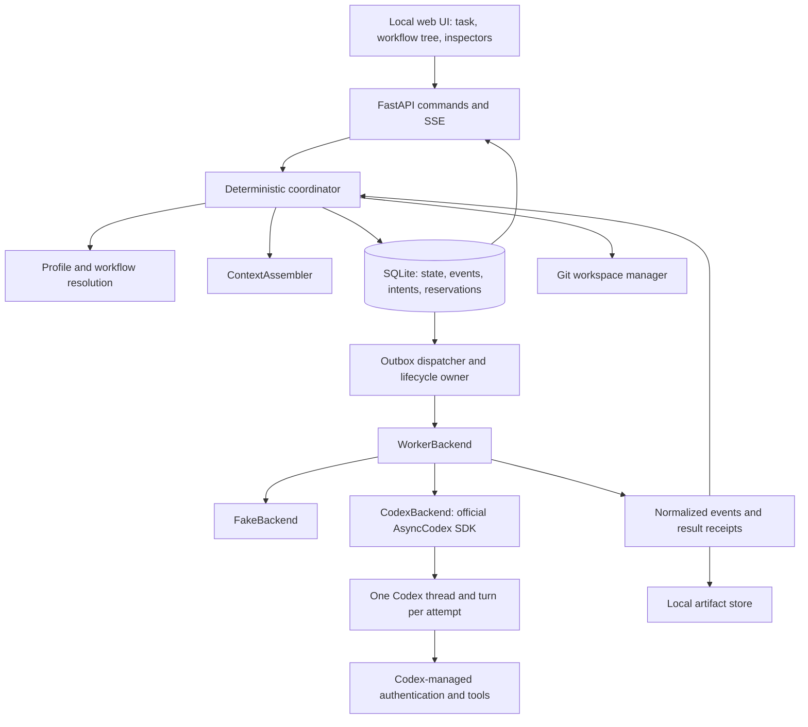

# Implementation plan

Status: proposed architecture and acceptance criteria, 28 September 2026. The starter contains configuration and development helpers; the application is to be implemented through the milestones below.

## 1. Runtime decision

Use **a small deterministic Python coordinator** with SQLite as the sole authority for workflow progression. Reuse the official Python Codex SDK for workers. The coordinator selects only declared routes and specialists; it does not run a model-driven delegation loop.

| Requirement | Deep Agents | LangGraph | Custom coordinator |
|---|---|---|---|
| Explicit topology, named specialists | Agent delegation needs additional constraints | Direct graph/node fit | Validated preset stages |
| Parallelism | Delegation still needs application admission limits | Parallel nodes; external-worker admission still needed | One transactional global/project/run admission check |
| Checkpoints, persistence, inspection | Inherits graph facilities | Strong built-in state/history | SQL state, immutable specifications and event journal |
| Pause/resume, conditional routes, retries | Harness behavior must be constrained | Native graph concepts | Small, explicit transition rules |
| Steer/stop external Codex workers | Requires adapter and supervisor | Requires adapter and supervisor | SDK adapter and lifecycle owner |
| Lock-in / total moving parts here | Adds another agent harness | Adds a second progression journal unless carefully integrated | Own a bounded scheduler; reuse worker transport |

LangGraph is a credible alternative. However, this product needs events, command receipts, worker attempts, resource reservations and launch intent committed atomically. Its SQLite checkpointer does not remove that ledger. Awaiting workers inside graph nodes adds reconciliation between two journals; using graph ticks only to emit an outbox leaves almost all scheduling in our code. For six bounded presets, a pure transition function is the smaller complete solution. [Evidence and switch conditions](INTEGRATION_AUDIT.md).

Custom scope is limited to DAG dependencies, fixed condition enums, bounded fan-out, joins, admission and transitions. No expression language, user code execution in workflow definitions, arbitrary graph editing or historical side-effect replay. Consider LangGraph again if richer graph composition becomes necessary and it can own progression without duplicating this ledger.

## 2. Architecture and module ownership



One Python process, one coordinator owner, one web-server worker, bound to `127.0.0.1`. FastAPI + Jinja templates + small JavaScript modules and Server-Sent Events (SSE); no frontend build tool. Serve bundled assets locally. Use SQLite WAL, foreign keys, a busy timeout and short transactions. Start one SDK client/app-server per active attempt so cancelling one worker cannot tear down siblings; accept the small process overhead at a default cap of four.

```text
src/orchestrator/
  app/           CLI, settings, composition root, process lifetime
  domain/        versioned models, IDs, states, policy validation
  runtime/       pure transitions, coordinator, admission, outbox dispatch
  backends/      protocol, fake adapter, Codex adapter and event mapping
  context/       resolution, bounded context assembly, provenance
  persistence/   SQLite repositories, migrations, transaction boundary
  workspaces/    Git snapshots, isolated worktrees, serial integration
  artifacts/     atomic file writes, manifests, content hashes
  api/           routes, command validation, SSE
  web/           Jinja templates and static JS/CSS
presets/         agents.toml and workflows/*.toml
config/          project/backend examples and development presets
tests/
  unit/          pure decisions and validation
  integration/   SQLite, recovery, workspace and HTTP behavior
  fixtures/      versioned configs, SDK event traces, fake scripts
  live/          opt-in Codex smoke tests
docs/            contracts, decisions and operating guide
```

Dependencies point inward to `domain`; the composition root wires implementations. Keep persistence behind one transaction API, not a generic repository per table. Start event models in `domain` and preset loaders there; add separate packages only when they have independent behavior.

## 3. Configuration and core models

Use **TOML + Pydantic v2**, `extra="forbid"`, explicit enums and `schema_version`. Generate JSON Schema from Python models. A frozen Pydantic object alone does not freeze nested dictionaries: serialize a canonical resolved specification, hash it, and never update that stored payload.

| Model | Required contents |
|---|---|
| `AgentProfile` | Stable ID, version, name, role, objective, base prompt; overlay references; backend and model binding; effort; skills/tools; permissions; context and disabled memory policy; timeout; retry policy; metadata |
| `WorkflowPreset` | Versioned ID; allowed profiles; required and optional stages; fixed/select-one/elastic slot limits; dependencies and parallel groups; declared conditions; allowed handoff redirects; outputs; completion rules; retry and wall-time limits |
| `OrchestratorPolicy` | Allowed profile/backend/model bindings, worker-count bounds, skip/redirect/retry decisions, permission ceiling and immutable required verification |
| `ProjectConfig` | Project path, workflow/profile overlay references, model bindings, project concurrency, permitted commands and workspace policy; settings revision |
| `RunSpec` / `RunState` | Immutable task, project snapshot, overrides, compiled workflow and profiles, plus a frozen resolved policy; mutable state projection, revision, active stages, budget counters |
| `AgentRunSpec` / `AttemptState` | Immutable attempt ID, parent retry ID, resolved profile/version, exact assembled instructions and input manifest, backend/model/effort, permissions, skills/tools, workspace revision; projected lifecycle, timestamps, receipt/artifact/error references |
| `Handoff` / `Artifact` | Source attempt, destination slot, input revision, content hash, project revision, schema and path; artifacts use managed relative paths |
| `Intervention` / `Event` | Command UUID, actor, target, expected run revision, kind, payload; event sequence, timestamp, cause, result and delivery status |

Every worker returns an `artifact-envelope-v1`: attempt ID, input revision, workspace revision if applicable, status (`pass`, `fail`, `blocked`), summary and typed artifact entries with content hashes. A report includes findings and evidence; a changes artifact includes a patch/commit and changed-file manifest; research findings include claim/source mappings. Validate both envelope and stage-specific payload. A valid envelope does not imply the stage passed.

Milestone 3 can currently validate envelope identity, required stage/profile output names, SHA-256 metadata, safe relative paths, and consumed input/workspace revisions. The v1 `WorkerResult` stores output hashes and a summary but no output bytes or stage-specific body schema registry, so report sections, prototype limitation labels, and research claim/source mappings cannot yet be checked. Define those payload contracts before wiring real worker output and workspaces.

Resolution order: shipped defaults → project overlay → user-selected run overrides, with **policy ceilings applied after merging**. Resolve model aliases against the selected backend's available models and supported effort values; persist the concrete IDs before dispatch. A missing binding or unsupported setting is a preflight error, not silent fallback. Skills default to empty and memory to `disabled`.

Milestone 1 overlay files are versioned, strict sparse patches. Agent overlays may change the base prompt, model binding, effort, timeout, context policy or permissions; permissions may only tighten the profile's declared set. Workflow overlays may choose a default profile from the stage's declared specialists or a worker count within its declared bounds. They cannot change stage IDs, dependencies, conditions, outputs, policy, or required verification. Run overrides use the same declared recipient/model/effort/count limits. Unless a workflow declares a narrower `permission_ceiling`, the selected profile's original permissions are the ceiling; v1 rejects permission expansion.

Resolved runs contain tuple-backed immutable snapshots, including `ResolvedOrchestratorPolicy`. Their SHA-256 is computed over canonical UTF-8 JSON for the complete resolved `RunSpec`, with sorted object keys, preserved list order, compact separators and the `snapshot_hash` field excluded. Older snapshots without the additive policy field deserialize with a fail-closed policy and cannot launch workers. Backend availability is supplied to the resolver as data; configuration validation does not query a provider. Shipped aliases such as `standard` can therefore validate while a run remains blocked until its project model binding and backend availability are present.

Overrides cannot replace workflow edges, remove required stages or expand permissions. An elastic slot resolves once to a count within min/max and that count is persisted in the resolved stage selection. No validated planner-partition model exists in v1, so the deterministic fallback is the minimum count; a future planner may only choose a count/partition after a versioned contract validates it. Research uses the first N declared `slot_briefs` plus the task; their explicit overlap is allowed because they do not write deliverable code. Select-one chooses one allowed profile using an explicit override or a declared default. Profiles default to the `standard` model binding; policy also permits `deep` and `fast` when the user configures them, allowing role-specific model routing. Backend alternatives must already be declared in policy; v1 ships only Codex and the test fake.

`ContextAssembler.build(profile, run_snapshot, task, input_manifest) -> ContextBundle` supplies the task, scoped responsibility, selected source references, dependency outputs and known constraints. Enforce a byte budget with deterministic truncation notices; never silently drop required inputs. Store supplied text/reference hashes and reasons for inclusion. Never copy the whole orchestration conversation. The inspector distinguishes app-assembled instructions from Codex's internal prompt and any inherited project instructions; the app cannot expose hidden model reasoning.

## 4. WorkerBackend contract

Keep SDK classes inside `backends/codex.py`. The following signatures are the proposed domain contract, not claims about SDK method names:

```python
class WorkerBackend(Protocol):
    async def capabilities(self) -> BackendCapabilities: ...
    async def preflight(self, spec: AgentRunSpec) -> PreflightResult: ...
    async def start(self, spec: AgentRunSpec) -> WorkerHandle: ...
    def events(self, handle: WorkerHandle) -> AsyncIterator[WorkerEvent]: ...
    async def steer(self, handle: WorkerHandle, command: SteerCommand) -> ControlAck: ...
    async def interrupt(self, handle: WorkerHandle) -> ControlAck: ...
    async def inspect(self, identity: WorkerIdentity) -> Reconciliation: ...
    async def close(self, handle: WorkerHandle) -> ShutdownReceipt: ...
```

Capabilities cover streaming, steering, interruption, saved-history inspection, output schemas, supported effort and enforceable permission settings. Unavailable controls are disabled with a reason. `start` is **not assumed idempotent**. A handle includes backend/version, attempt, session/thread/turn identity and lifecycle owner identity. A terminal event carries a normalized result, provider status and usage if supplied; unknown usage remains null.

Codex mapping: official `AsyncCodex` → `thread_start` → `thread.turn` → a single consumer of `turn.stream()`. Steering uses `turn.steer`; cancellation uses `turn.interrupt`. Explicitly set `ApprovalMode.deny_all`, a sandbox enum and the resolved model. Supply the app instructions as developer instructions and the task/context as input, retaining Codex's harness base instructions. Treat only a terminal turn event or reconciled saved terminal receipt as completion. See [the integration audit](INTEGRATION_AUDIT.md) for the pinned source check and authentication boundary.

The adapter must verify effective filesystem/network settings and ambient integrations. Codex sandbox modes are enforceable boundaries; a prompt saying “only run tests” is not a shell-command whitelist. Mark tool intentions separately from enforced capabilities. Unsupported mandatory restrictions fail preflight. Isolate harness configuration under the app's Codex home, let Codex perform login, and inspect project-level configuration before executing it. Implement no custom OAuth or credential database.

The Milestone 1 fake backend releases each scripted event only when its test barrier is opened. A manual monotonic clock and scripted control acknowledgements make later scheduler tests deterministic without wall-clock sleeps. Static validation explores the declared repair branches and checks that required outputs and verification stages reach the completion outputs; it does not execute those gates.

## 5. State, scheduling and persistence

Run path: `ready → running → succeeded | failed`. Control paths: `running → pause_requested → paused → running`; any nonterminal run may enter `stopping → stopped`, or `attention_required` when reconciliation/input is needed. `attention_required` inhibits new launches; resolving its reason resumes the prior intended state. Final success requires the preset's completion rule and validated outputs, not merely zero active workers.

Attempt path: `pending → launching → running → succeeded | failed | timed_out`; cancellation goes through `cancel_requested → cancelled`. Launch/stream/process ambiguity produces `outcome_unknown`. Recovery may reconcile unknown to a known terminal status but cannot blindly relaunch it. A retry is a **new attempt ID** for the same slot, preserving the previous attempt and its input lineage.

Distinguish execution failure from a successful test/review report containing findings. `artifact_ready` requires a valid usable output with pass status; `report_present` accepts a valid pass/fail report; `report_passed` additionally requires pass. Blocked reports require attention rather than satisfying any gate. A failed review/test report may trigger the declared repair branch; a crashed tester never counts as completed verification. Repair is a bounded workflow branch, separate from infrastructure retries.

Each coordinator transaction validates the expected revision, appends events, updates projections, reserves capacity/workspace ownership and records an outbox action. External effects happen after commit; acknowledgement is a second transaction. Use command UUIDs and unique action keys to detect duplicate delivery. After a dispatcher crash, a claimed launch intent is ambiguous until reconciled; do not simply make it pending again. One OS lock plus a persistent owner generation prevents two local coordinators from dispatching simultaneously.

Admission counts launching, running, cancelling and unresolved unknown attempts. Apply global, project, run and slot caps together. Initial defaults: global 4, project 4, run 4; workflows can be lower. Stable stage/slot ordering determines admission and join ordering. Never hold a database transaction open during worker execution. A stopped HTTP request is not a stopped worker.

Use tables for projects/config revisions, runs, stages, immutable attempt specs, attempt projections, events, interventions, outbox actions, reservations, handoffs and artifact manifests. Store substantial output under `<data_dir>/runs/<run_id>/attempts/<attempt_id>/`; write temporary files then atomically rename and publish their hashes. Keep compact events and references in SQLite; cap raw event/log sizes. Partial artifacts remain labelled partial. SQLite migrations use a schema version and backup guidance.

Milestone 3 adds schema-v2 immutable normalized attempt results and stage output projections to SQLite. `ExecutionCoordinator` uses the resolved policy and topology to advance deterministic gates, creates launch attempts/reservations/outbox intents in one transaction, then calls the backend and records acknowledgement outside that transaction. In this milestone the backend is scripted fake only. On restart, pending actions may be claimed; already claimed or acknowledged active fake launches are quarantined as `outcome_unknown` and retain capacity rather than being replayed. Milestone 4 must add the reconciliation path that can settle those reservations safely.

On restart, reconstruct state from committed projections/events and durable receipts, not by replaying worker actions. Reuse verified completed results. Reconcile known Codex thread/turn history; active-process reattachment is not promised. Unknown attempts retain reservations until the owned process is confirmed stopped and the workspace is inspected. A PID alone is insufficient proof. A timeout requests interruption and bounded shutdown; if death cannot be established, preserve `outcome_unknown` instead of falsely releasing ownership.

### Workspace isolation

Parallel writers must not share a working directory. For write workflows, require a Git repository and a clean selected base at preflight; never auto-stash the user's work. Create a run integration worktree and separate attempt worktrees from a recorded commit. Read-only workflows may inspect a non-Git directory, but report its snapshot/reproducibility limits.

Successful writing attempts produce a patch/commit plus tests and a changed-file manifest. A deterministic integration stage applies accepted changes serially in stable slot order to the run worktree. A conflict enters `attention_required`; preserve both outputs. Reviewers and testers inspect the same integrated revision in separate worktrees. Tester-created files never flow into the deliverable unless explicitly accepted as implementation output. Repairs create a new revision and require new review/tests. Handoff exports the resulting branch/patch and evidence; applying it to the user's original branch is a separate action.

## 6. Interventions

All commands persist their intent, validation outcome and eventual delivery result. Requests include a command UUID and expected run revision; reject stale requests rather than targeting whatever worker happens to be active.

| Control | Exact v1 semantics |
|---|---|
| Pause workflow | Inhibit new launches; let current workers drain. Display “Pausing: N active” until quiescent, then `paused`. No process suspension. |
| Resume | Validate/reconcile pending state, then permit admission. Does not resurrect a killed process. |
| Stop workflow | Inhibit launches; request all active workers to interrupt, then bounded shutdown. Mark `stopped` only when ownership is settled; otherwise require attention. Preserve partial work. |
| Stop selected agent | Cancel only that attempt. A required slot becomes unresolved and needs retry or stopping the run; it cannot silently disappear. |
| Steer current agent | Address one running attempt and exact turn; append a scoped input event and delivery acknowledgement. Do not rewrite its initial specification. If the turn ended or delivery is uncertain, show that outcome; never silently retarget. |
| Retry selected agent | Allowed only after a known terminal, classified failure/cancellation within budget and settled workspace ownership. Make a new immutable attempt; preserve successful siblings. Terminal runs remain historical; restarting one creates a new run. |
| Redirect next handoff | In v1, select a different approved recipient profile within an unlaunched select-one stage. Preserve its dependencies, input manifest and output contract. Reject active/completed stages, profiles outside `allowed_redirects`, and permission expansion. |

Steering changes the effective input revision for that attempt's future outputs. Outputs carry the final acknowledged input revision. A result whose consumed input hash/revision no longer matches its dependency is stale and cannot satisfy completion. Redirecting before dispatch avoids modifying already running consumers. The supplied research preset permits verifier ↔ reviewer before verification launches; prototype permits either approved implementer. Redirect does not skip a stage or rewire the graph. V1 does not support arbitrary live model, skill, graph or parallelism edits.

## 7. Initial product presets

The complete proposed definitions are in `presets/`. Defaults favor one implementation worker; parallel implementation is available only with a validated partition and isolated workspaces.

| Workflow | Stages and bounds | Completion |
|---|---|---|
| Review | reviewer → report; cap 1 | Valid report; findings may remain |
| Prototype | planner → prototype implementer → integrate → quick validator → handoff; cap 1 | Validation report and labelled limitations; does not claim production readiness |
| Feature | planner → 1–3 implementers → integrate → reviewer + tester → repair gate → optional fixer/integrate/re-review/re-test → handoff; cap 4 | Current-revision review and tests pass; at most one repair cycle |
| Debug | debugger → implementer → integrate → regression tester → reviewer → handoff; cap 2 | Reproduction evidence plus regression and review pass |
| Research | 2–3 researchers → synthesizer → verifier; cap 3 | Referenced synthesis and verification report; unresolved claims labelled |
| Final handoff | integration check → tester → reviewer → summary; cap 1 | Same-revision integration, tests and review pass |

Product specialists: planner, implementer, prototype implementer, debugger, reviewer, tester, quick validator, researcher, synthesizer, verifier and handoff writer. Each has a narrow output contract. Their prompts and defaults are real TOML fixtures, not development Codex profiles. A writing specialist is reused for repairs instead of adding a redundant “fixer” profile. Integration and condition gates are deterministic stages, not agent personas.

The TOML condition vocabulary is closed: `always`, `repair_needed`, `repair_not_needed`. `repair_gate` derives its branch from normalized review/test results. `selected.*` inputs resolve through the explicit `branch_outputs` map to the chosen revision/reports. Inputs from elastic stages are ordered collections from every required slot. Optional repair stages may be skipped only when their condition is false; choosing the repair branch makes its verification mandatory. Dependencies on a skipped conditional stage resolve only through the declared branch; a join cannot treat arbitrary missing outputs as success. Static validation checks both possible branches, every required verification path, acyclicity, all output bindings and bounded expansion. No `eval` or arbitrary condition strings.

## 8. UI and local operation

Main view: project picker, task field, workflow picker, collapsed permitted overrides and Run. Before dispatch show the resolved worker count, model bindings, permissions and validation errors. Remember project settings locally.

Run view: ordered stage/tree rows, named worker slots, dependency/handoff links, waiting reasons and counts such as `2 active / 4 allowed`. Distinguish blocked, pausing, cancelled, failed and uncertain states. Selecting an agent opens tabs **Profile / Effective Prompt / Model–Backend / Skills / Tools / Context / Output / Events**. Display retry lineage, provenance and enforcement status without claiming access to Codex's full internal prompt.

Workflow inspector: original preset/version, resolved topology and policy, allowed discretion, overrides and run history. Control buttons reflect the state machine; steer uses a selected target, retry shows the remaining budget, and redirect presents only valid recipients. Event chronology shows requested versus acknowledged controls.

SSE sends ordered persisted event IDs; reconnection uses the last ID and refreshes projections. The server, not the browser, owns execution. Refreshing or closing the page must not cancel a run. Add keyboard navigation, readable status text and log truncation. Bind only to loopback, validate Host/Origin and require a local session/CSRF token for mutating browser requests; this prevents arbitrary websites issuing local commands without adding user accounts. File downloads resolve only through artifact IDs under the managed store.

## 9. Deterministic test matrix

| Area | Required evidence |
|---|---|
| Schemas/resolution | All shipped TOMLs load; unknown fields, cycles, invalid references, permission widening, unsupported effort, missing outputs and unbounded slots fail with paths; snapshots preserve old versions |
| State transitions | Table-driven valid/invalid transitions; execution failure differs from findings; success requires the completion gate |
| Scheduling | Controllable fake clock and event barriers, no wall-clock sleeps; competing runs never exceed global/project/run caps; successful siblings remain complete |
| Retries | Only approved failure classes retry; attempt/time/repair budgets terminate; new IDs and lineage; unknown launches are not auto-retried |
| Controls | Pause drains and launches nothing new; stop affects intended workers; stale/duplicate commands; steer completion race; requested/acknowledged/unknown receipts persist |
| Redirect | Undeclared recipient, incompatible output contract, permission expansion and active stage rejected; allowed recipient choice and unchanged inputs preserved after restart |
| Persistence/restart | Crash before/after intent, launch acknowledgement and terminal receipt; no duplicate launch; uncertain effects become attention-required; events/projections agree |
| Backend contract | Shared fake/Codex-fixture suite: terminal event, disconnect, malformed output, unsupported control, timeout, cancellation and missing usage |
| Workspaces | Two writers isolated; deterministic integration; dirty source unchanged; conflicts block; tests/review reference exact integrated revision |
| UI/API | Run/inspect/control/reload with fake workers; SSE reconnect; status/control legality; artifact traversal and cross-origin requests rejected |

SDK fixtures must record their SDK/CLI versions and contain no credentials. Optional `live` tests cover one short read-only turn and one actively steered/interrupted turn. They require an explicit environment opt-in and configured account, have strict time limits, and report model availability/quota failures separately from application defects. Live success does not substitute for deterministic recovery tests.

## 10. Eight implementation milestones

| Milestone | Objective and implementation | Acceptance criteria | Depends on |
|---|---|---|---|
| **1. Contracts and executable skeleton** | Package/CLI, Python models, TOML loaders, settings, JSON Schema, fake clock/backend protocol, basic logging and dev tools. | All shipped presets validate; negative schema fixtures pass; CLI help and config validation work; lint/type checks and offline tests pass. No worker launch or web UI yet. | Starter |
| **2. Durable run ledger** | SQLite migrations, immutable specs, event/projection transaction API, artifact store, owner lock, command IDs and outbox. | Reopening preserves snapshots/events; duplicate commands apply once; failure injection proves transaction rollback and atomic artifact publication. | 1 |
| **3. Bounded fake execution** | Ready-stage selection, slots/joins, reservations, fake dispatch, result contracts, condition gates and bounded retries. | All six workflows run against scripted fake workers; cross-run caps and successful-sibling retention pass; feature repair branch terminates. | 2 |
| **4. Controls and recovery** | Pause/resume/stop/steer/retry/redirect semantics, delivery receipts, timeout/shutdown policy and restart reconciliation. | Every control race and launch crash window in the test matrix passes; ambiguous effects never relaunch automatically; closing a client leaves execution intact. | 3 |
| **5. Codex adapter** | Pin official SDK/CLI; model/account preflight, config isolation, explicit approval/sandbox settings, stream mapping, control and saved-history inspection. | Versioned offline fixtures pass; mandatory settings are enforced or rejected; optional live read-only and steer/interrupt smoke tests succeed when authorized account is available. Record limits; no undocumented process reattachment claim. | 4 |
| **6. Context and real project workspaces** | Provenance-aware ContextAssembler, Git isolation and serial integration; wire real workflows including repair verification. | Dirty source is preserved; independent workers never share writable directories; conflict pauses; current revision is verified before handoff; context budgets and skill hashes inspectable. | 4, 5 |
| **7. Usable local UI** | Task form, stage/tree view, eight agent tabs, workflow inspector, runtime controls, history and resumable SSE. | End-to-end fake runs cover all controls and browser reload; readable blocked/uncertain states; local-request protections pass; `uv run agent-orchestrator` opens UI. | 6 |
| **8. Installable personal release** | CLI packaging, operation/recovery guide, exportable handoff, CI, compatibility notes, bounded logging and uninstall/data guidance. | Fresh macOS checkout installs from lock; deterministic CI passes; restart/control smoke path documented; `uv tool install .` exposes one-command launch. | 7 |

Keep each milestone independently reviewable. Do not implement later functionality as placeholders that claim to work. The exact first task is [tasks/01-foundation.md](../tasks/01-foundation.md).
